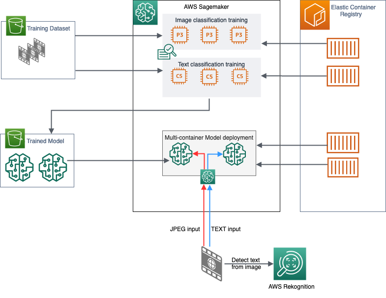

# Memotion Analysis

This notebook aims to classify Internet memes based on the type of humour i.e.sarcasm, offensive, motivational and understand the overall sentiment. Internet memes are deeply ingrained in social media platforms such as Facebook, Instagram, and Twitter and a deeper analysis of their symbolic meaning helps us to understand the opinion of a community. 

This notebook uses the Kaggle dataset - https://www.kaggle.com/williamscott701/memotion-dataset-7k which contains human annotated tags of sentiment and humour for each of the images.

I have used Amazon Sagemaker's multi-container endpoint with direct invocation to deploy Amazon's Image Classification model and BlazingText model and ensembled the individual predictions using averaging from each model to arrive at the final prediction for evaluation. The datasets present a multilabel multiclass classification problem and I have used augmented file format to load the dataset using RecordIO wrapper and "class-id" label formating for training the individual models.

# Architecture diagram 

# Implementation Steps

### Prepare your Amazon SageMaker Jupyter notebook.
Specify the Amazon SageMaker role Amazon Resource Name (ARN) used to give learning and hosting access to your data. IAM role should have access to AWS Rekognition for extracting text from memes - extract text will be fed to real-time inferencing endpoint.

Amazon S3 bucket that will be used for training and storing model objects.

### Data Exploration, Analysis and Preparation
##### Data Cleaning
Analyse the catalogue and remove columns that have NaN data.

Drop OCR Text and consider only Corrected Text column.

Convert the images to JPEG format and resize to (224,224).

##### Data Analysis
Visualize the data to see the spread  within each feature in a histogram and scatter matrix. The scatter-plot matrix displays the correlation between pairs of variables & makes it easy to look at all pairwise correlations in one place.

##### Data Preparation
Divide the dataset into Training(80%), Validation(10%) & Testing(10%) sets.

Create Augmented Manifest files for text and image with references to 19 classes in the below jsonlines format -

Image - {"source-ref": "s3://s3-base-path/Memotion_Analysis/blazingtext/train/image_1.jpg", "class": "[1, 4, 9, 13, 18]"}

Text - {"source": "10 year challenge  sweet dee edition", "label": "[3, 6, 11, 12, 16]"}

### Build Image Classification Model

I used Amazon SageMaker image classification algorithm for multi-label classification. It uses a convolutional neural network (ResNet) that can be trained from scratch or trained using transfer learning when a large number of training images are not available. To save on training costs I have used Spot instances for training. 

The hyperparameters are -

Number of layers: 50.

Number of classes: 19.

Number of epochs: 30.

Set multi_label to 1.

Used transfer learning.

Instance type - P3

Input images are served using Augmented Manifest file wrapped in RecordIO format in Pipe mode.

_Time taken for training - ~1 hour_

Model container is created with the name _'image-classification'_

### Build Text Classification Model 

I used Amazon SageMaker BlazingText algorithm  for the text classification. BlazingText algorithm provides highly optimized implementations of the Word2vec and text classification algorithms. Text classification is an important task for applications that perform web searches, information retrieval, ranking, and document classification.

The hyperparameters used for training are:-
Mode: 'supervised'.

Number of epochs = 10.

Set 'min_count' to 2.

Instance type - C5

The processed text is served as Augmented Manifest file wrapped in RecordIO format. 

_Time taken for training - ~15 minutes_

Model container is created with the name _'blazingtext'_

### Hosting the models

Create a multicontainer endpoint using the containers _'image-classification'_ and _'blazingtext'_ . 

Instance Type - M5.  

### Ensemble the output and validate
Use the single endpoint for image and text classification using the container names. Perform simple average of the two models and evaluate on test sets. The performance for each class can be evaluated using confusion matrix. The confusion matrix provides a visual representation of the performance based on the accuracy of the multiclass classification predictive model. 

### Real-time inferencing. 

We can run real-time predictions using any Meme image as input - the text from the image is extracted using AWS Rekognition APIs and sent to _'blazingtext'_ container for text classification. The image is fed as input to it to _'image-classification'_ container.  

# Scope for improvement
This example can be extended in several ways such as picking a different model for training, bringing your own custom model, training a separate model for peforming the ensemble instead of a taking a simple average.
